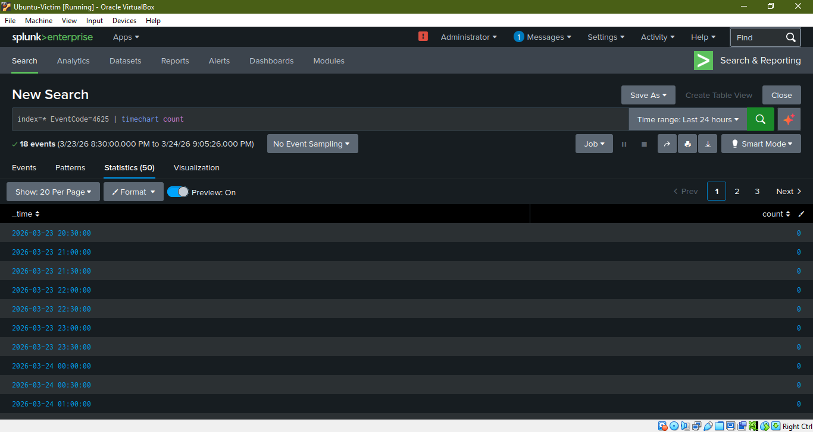
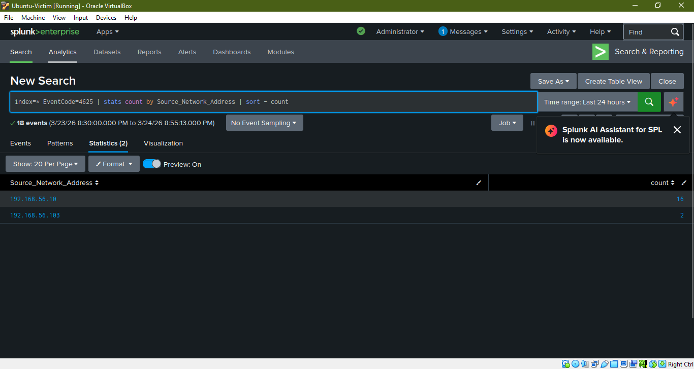
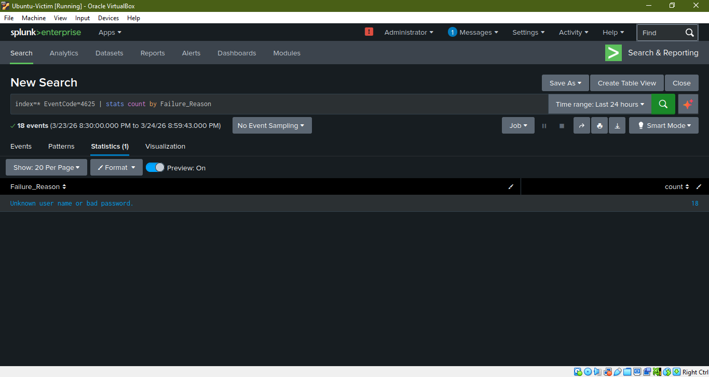
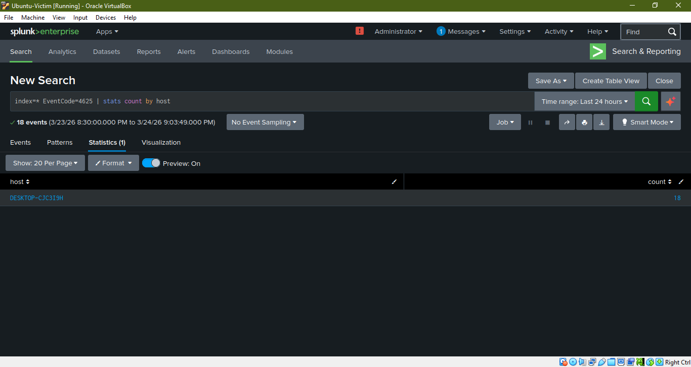
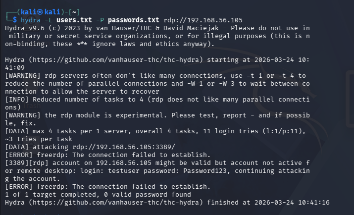

# 🔐 Windows SOC Lab - RDP Brute Force Detection

## 📌 Project Overview
This project demonstrates detection of an RDP brute-force attack using Splunk SIEM in a Windows environment.

## 🏗️ Lab Architecture
- Attacker: Kali Linux
- Victim: Windows 10
- SIEM: Splunk Enterprise (Ubuntu)
- Log Forwarding: Splunk Universal Forwarder

## ⚔️ Attack Simulation
Performed RDP brute-force attack using Hydra:
hydra -L users.txt -P passwords.txt rdp://192.168.56.105

## 🔍 Detection
- Windows Event ID 4625 (Failed Login)
- Splunk queries used to detect brute force behavior

## 📊 Dashboard
Created Splunk dashboard showing:
- Failed login trends
- Attacker IPs
- Failure reasons
- Target systems

## 🧾 Key Findings
- Attacker IP: 192.168.56.103
- Target User: testuser
- Multiple failed login attempts detected

## 🛡️ Mitigation
- Enable account lockout policies
- Enforce strong passwords
- Enable MFA
- Restrict RDP access

## 🧠 Skills Gained
- SIEM (Splunk)
- Log analysis
- Threat detection
- Incident response
- Dashboard creation

## 📸 Screenshots

### 🔹 Failed Login Trend

### 🔹 Attacker IP Detection

### 🔹 Failure Reason

### 🔹 Target System

### 🔹 Hydra Attack Simulation

---
